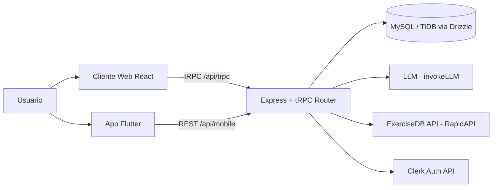

# 01 · Project Overview — FerFit 2

> Última actualización: 2026-07-04

## 1. Objetivo del proyecto

FerFit 2 es una plataforma de fitness que genera **planes de entrenamiento y nutrición personalizados usando IA (LLM)**, y acompaña al usuario en la ejecución diaria de esos planes mediante checklists, seguimiento de progreso y un sistema de gamificación (XP, niveles, rachas, logros).

El producto tiene dos clientes activos:
- **Web** (React), la superficie principal y más completa.
- **Móvil** (Flutter, `ferfit_flutter/`), un cliente que consume una API REST propia (`/api/mobile/*`) espejo del backend web.

## 2. Problema que resuelve

Contratar un entrenador personal y un nutricionista es costoso y poco accesible. FerFit 2 automatiza esa personalización: a partir de un cuestionario (objetivo, nivel, datos físicos, equipo disponible, lesiones, preferencias), un LLM genera una rutina de 12 semanas con ejercicios, series/reps, progresión, y un plan nutricional con macros y comidas — todo adaptado al perfil declarado.

Un problema secundario que el proyecto ataca explícitamente (ver [BITACORA.md](../BITACORA.md)) es la **fiabilidad de la IA generativa**: los LLMs pueden alucinar nombres de ejercicios que no existen en ninguna base de datos de imágenes/GIFs. La solución adoptada es un **catálogo RAG cerrado** (`server/_core/catalog.ts`) del cual el modelo está obligado a elegir, combinado con **Structured Outputs** (JSON Schema estricto) para garantizar que la respuesta del LLM siempre sea parseable.

## 3. Público objetivo

Usuarios finales de fitness (principiantes a avanzados) que quieren una rutina personalizada sin pagar un coach humano. No hay hoy un rol "entrenador" ni funcionalidades B2B — es una app de consumo directo (B2C), single-tenant por usuario.

## 4. Idea general del sistema

1. El usuario se registra/loguea (Clerk).
2. Completa un wizard de 5 pasos (objetivo, datos físicos, días/equipo, lesiones, preferencias).
3. El backend arma un prompt masivo y llama a un LLM pidiendo una respuesta JSON estricta (plan de entrenamiento de 12 semanas + plan nutricional).
4. El plan se enriquece: se traducen los nombres de ejercicio a español y se buscan GIFs reales vía ExerciseDB (RapidAPI).
5. El plan se persiste en MySQL (`training_plans.generatedContent`, como JSON serializado en una columna `text`).
6. El usuario ejecuta el plan día a día: marca series completadas, gana XP, sube de nivel, mantiene una racha (streak) y desbloquea logros.
7. El progreso se visualiza en calendario, gráficos (Recharts) y se puede exportar a PDF.

## 5. Arquitectura general

Monorepo con tipado end-to-end vía tRPC:

```
client/           → Frontend web (React 19 + Vite + TailwindCSS v4)
server/           → Backend (Express 4 + tRPC 11)
  _core/          → Infraestructura, integraciones externas, motor de IA/catálogo
shared/           → Tipos y constantes compartidos entre client y server
drizzle/          → Schema de base de datos (Drizzle ORM) + migraciones SQL
ferfit_flutter/   → App móvil Flutter, consume /api/mobile/* (REST, no tRPC)
mockups/          → Assets de diseño (imágenes, no código)
docs/             → Esta documentación
```

Ver detalle de cada capa en [02_FRONTEND.md](02_FRONTEND.md), [03_BACKEND.md](03_BACKEND.md) y diagramas en [05_ARCHITECTURE.md](05_ARCHITECTURE.md).

## 6. Flujo de información (alto nivel)



## 7. Tecnologías utilizadas

| Capa | Tecnología |
|---|---|
| Frontend Web | React 19, Vite 7, TailwindCSS v4, Radix UI, wouter (routing), TanStack React Query, Recharts, jsPDF, Streamdown |
| Comunicación tipada | tRPC 11 + superjson |
| Backend | Express 4, Node.js (tsx/esbuild), Zod para validación |
| ORM / DB | Drizzle ORM sobre MySQL/TiDB (`mysql2`) |
| Autenticación | Clerk (principal) + capa legado "Manus OAuth" como intento previo/fallback |
| IA | LLM vía helper propio `invokeLLM` (proxy "Forge", compatible OpenAI Structured Outputs) |
| Datos de ejercicios | ExerciseDB (RapidAPI) para GIFs/instrucciones |
| Mobile | Flutter (Dart), `http`, `shared_preferences`, `fl_chart`, `table_calendar` |
| Testing | Vitest (`tests/`) |
| Build/Deploy | Vite build + esbuild bundle del server a `dist/`, target Vercel (mencionado en historial de commits) |

## 8. Dependencias principales (resumen)

Ver [package.json](../package.json) para la lista completa. Las más relevantes arquitectónicamente:
- `@trpc/*`, `@tanstack/react-query`, `superjson` — comunicación tipada cliente-servidor.
- `drizzle-orm`, `mysql2` — acceso a datos.
- `@clerk/clerk-react` — autenticación de usuario.
- `zod` — validación de inputs tRPC.
- `jspdf` — exportación de planes a PDF.
- `recharts` — gráficos de progreso.
- `axios`, `cookie`, `jose` — usados por la capa de autenticación legada "Manus" (`server/_core/sdk.ts`).

## 9. Estado actual del proyecto

- **Working tree activo con cambios grandes sin commitear** (ver `git status`): refactors profundos en `GeneratedTrainingPlanView.tsx`, `Dashboard.tsx`, `Progreso.tsx`, `routers.ts`, entre otros. Último commit: `4b838ca Modificaciones para guardar rutina`.
- El proyecto fue inicialmente scaffoldeado sobre una plataforma llamada **"Manus"** (ver `references/*.md`, `template.json`, `.manus-logs/`) que provee helpers preconfigurados de LLM, OAuth, storage, mapas, notificaciones, etc. Gran parte de esa capa de integración (`heartbeat.ts`, `imageGeneration.ts`, `map.ts`, `notification.ts`, `voiceTranscription.ts`) **no está en uso** por las features actuales de FerFit — ver [07_TECHNICAL_DEBT.md](07_TECHNICAL_DEBT.md).
- La autenticación migró de "Manus OAuth" a **Clerk**, pero el código de `context.ts` todavía intenta primero la autenticación Manus antes de caer al fallback Clerk (double-auth path).
- Existe una app Flutter funcional (`ferfit_flutter/`) con las mismas 5 pantallas que la web, consumiendo el backend vía una API REST espejo (`server/_core/mobileApi.ts`).
- Documentación de dominio ya existía antes de este documento: [BITACORA.md](../BITACORA.md), [PROJECT_REVIEW.md](../PROJECT_REVIEW.md), [WALKTHROUGH.md](../WALKTHROUGH.md) en la raíz del repo — se mantienen como bitácora de decisiones de producto; esta carpeta `docs/` es la documentación técnica de arquitectura.
- Hay archivos sueltos en la raíz sin integrar al proyecto formal (scripts `test_*.ts`, `tmp_clerk_*`, un `app-release.apk` de 55MB) — ver [07_TECHNICAL_DEBT.md](07_TECHNICAL_DEBT.md).
