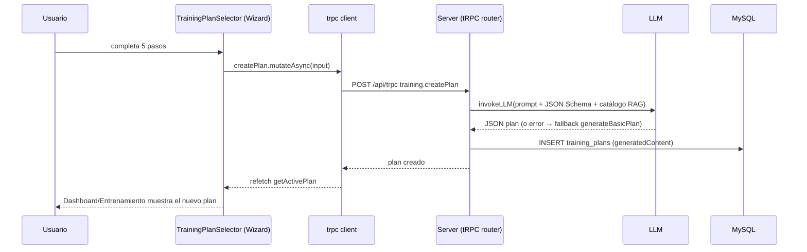

# 02 · Frontend — Cliente Web (`client/`)

> Última actualización: 2026-07-04

## 1. Estructura de carpetas

```
client/src/
├── _core/hooks/useAuth.ts        # Hook de auth legado (tRPC auth.me), pre-Clerk
├── components/
│   ├── ui/                        # ~50 componentes shadcn-like (Radix + Tailwind)
│   ├── AIChatBox.tsx               # Chat con LLM, listo para usar (presentational)
│   ├── CalendarMultiView.tsx       # Calendario alternativo (no usado activamente)
│   ├── CalendarMultiViewEnhanced.tsx
│   ├── ClerkTokenProvider.tsx      # Sincroniza token de Clerk a localStorage
│   ├── DashboardLayout.tsx         # Layout autenticado (header/nav/footer)
│   ├── DashboardLayoutSkeleton.tsx
│   ├── DayDetailsDrawer.tsx        # Drawer de detalle de un día de entrenamiento
│   ├── ErrorBoundary.tsx           # Error boundary de React
│   ├── ExerciseCard.tsx            # Card de lectura de 1 ejercicio
│   ├── ExerciseChecklist.tsx       # Checklist interactivo de series por ejercicio
│   ├── GeneratedTrainingPlanView.tsx  # Vista principal del plan de IA
│   ├── LogoIcon.tsx                # Logo SVG de la marca
│   ├── ManusDialog.tsx             # Dialog legado (previo a Clerk)
│   ├── Map.tsx                     # Sin uso
│   ├── ProgressGraphs.tsx          # Gráficos Recharts de progreso por ejercicio
│   └── TrainingPlanSelector.tsx     # Wizard modal de 5 pasos
├── contexts/ThemeContext.tsx       # Tema (fijo en dark)
├── hooks/
│   ├── useClerkToken.ts
│   ├── useComposition.ts           # IME-aware para inputs (chat)
│   ├── useMobile.tsx                # media query 768px
│   └── usePersistFn.ts              # alternativa a useCallback
├── lib/
│   ├── exerciseTranslations.ts     # diccionario EN→ES (136 entradas), lookup vía Proxy
│   ├── exportPDF.ts                 # generación de PDF del plan con jsPDF
│   ├── levels.ts                    # cálculo de nivel/progreso a partir de XP
│   ├── trpc.ts                      # cliente tRPC tipado (createTRPCReact<AppRouter>)
│   └── utils.ts                     # cn() = clsx + tailwind-merge
├── pages/
│   ├── Home.tsx                     # landing pública
│   ├── Dashboard.tsx                # hub central
│   ├── Entrenamiento.tsx            # vista del plan + export PDF
│   ├── Nutricion.tsx                # plan nutricional
│   ├── Progreso.tsx                 # historial, calendario, logros, gráficos
│   ├── NotFound.tsx
│   └── ComponentShowcase.tsx        # demo de componentes ui/
├── App.tsx                          # routing (wouter) + providers + auth guard
├── main.tsx                         # entry point: React root, tRPC + QueryClient
├── types.ts                         # tipos de dominio (Exercise, TrainingPlan, etc.)
├── const.ts                         # helpers OAuth legado ("Manus")
└── index.css                        # variables OKLCH, Tailwind v4 theme, glassmorphism
```

## 2. Sistema de navegación y rutas

Router: **wouter** (no Next.js). Definido en `App.tsx`.

| Ruta | Página | Acceso |
|---|---|---|
| `/` | `Home` | Público (redirige a `/dashboard` si ya hay sesión) |
| `/dashboard` | `Dashboard` | Protegida |
| `/entrenamiento` | `Entrenamiento` | Protegida |
| `/nutricion` | `Nutricion` | Protegida |
| `/progreso` | `Progreso` | Protegida |
| `/404` (catch-all) | `NotFound` | Público |

**Guard de autenticación** (`App.tsx`):
- `ProtectedRoute`: si Clerk no está configurado (`VITE_CLERK_PUBLISHABLE_KEY` ausente), muestra un mensaje de error de configuración.
- `AuthenticatedRoute`: usa el `useAuth()` de Clerk — mientras carga muestra spinner; si no hay sesión, redirige a `/`; si hay sesión, renderiza la página.

**Jerarquía de providers** (`App.tsx` → `main.tsx`):
```
trpc.Provider (cliente tRPC)
 └── QueryClientProvider (React Query)
      └── ClerkProvider
           └── ClerkTokenProvider        (sincroniza token Clerk)
                └── ErrorBoundary
                     └── ThemeProvider (defaultTheme="dark")
                          └── TooltipProvider
                               └── Toaster (sonner)
                                    └── Router (wouter) → Switch de páginas
```

## 3. Páginas principales

### Home.tsx
Pública. Nav sticky + hero + grid de features (plan IA, guías de ejercicios, nutrición, XP/niveles, calendario, progreso) + CTA final. Si Clerk está configurado y el usuario ya inició sesión, redirige automáticamente a `/dashboard`.

### Dashboard.tsx
Hub central, protegida. Layout de 3 columnas en desktop / apilado en mobile:
- **Izquierda**: gráfico de progreso semanal (pasos/calorías, Recharts) y checklist de entrenamiento de hoy.
- **Derecha**: barra de XP/nivel, metas diarias (pasos, calorías), stats rápidas (HR, sueño, recuperación).
- **Abajo**: tarjetas de consejos generados por IA.

Llamadas tRPC: `training.getActivePlan`, `training.getUserProgress`, `training.getTodayChecklist`, `training.getDashboardData`, `training.getAITips`. Acciones: abrir `TrainingPlanSelector` ("Crear mi rutina") o disparar `training.generateDemoRoutine` ("Generar Demo").

### Entrenamiento.tsx
Sin plan → empty state con CTA para crear uno. Con plan → renderiza `GeneratedTrainingPlanView`. Incluye botón de descarga de PDF (`exportTrainingAndNutritionPlanToPDF`).

### Nutricion.tsx
Lee `training.getActivePlan` y muestra `plan.nutrition`: comidas del día (desayuno/almuerzo/cena), macros como anillos SVG concéntricos (proteína/carbos/grasas), hidratación, suplementación y notas.

### Progreso.tsx
Combina `getUserProgress`, `getCompletedDates`, `getActivePlan`, `getChecklists`. Muestra tarjeta de nivel, grid de stats (XP, racha, series completadas, días completados), gráficos por ejercicio (`ProgressGraphs`), grid de logros y un calendario (`TrainingCalendar`) de 120 días hacia adelante con detalle de día seleccionado.

## 4. Componentes clave

- **`DashboardLayout.tsx`**: wrapper de todas las páginas protegidas. Header con nav horizontal en desktop, bottom nav de 5 ítems en mobile (breakpoint 768px vía `useIsMobile`).
- **`GeneratedTrainingPlanView.tsx`**: vista del plan generado; navega días (prev/next), trae GIF del ejercicio activo vía `training.searchExerciseWithMedia` (fallback `training.searchExercise`), incluye timer de descanso.
- **`TrainingPlanSelector.tsx`**: modal wizard de 5 pasos (objetivo+nivel → datos físicos → días/equipo → lesiones → preferencias) que arma el input de `training.createPlan`.
- **`AIChatBox.tsx`**: componente presentacional de chat (no llama tRPC directamente); markdown vía `Streamdown`, IME-aware con `useComposition`.
- **`TrainingCalendar.tsx`**: recibe `CalendarDay[]`; renderiza anillos SVG de progreso (estilo Apple Fitness) por día — verde completo, amarillo parcial, púrpura sin progreso, gris para día de descanso.
- **`ExerciseCard.tsx`** / **`ExerciseChecklist.tsx`**: presentación de un ejercicio de solo lectura vs. checklist interactivo (marca series, peso, reps, notas) durante una sesión.
- **`ProgressGraphs.tsx`**: 4 tabs de Recharts (peso, reps, duración, XP) por ejercicio.
- **`LogoIcon.tsx`**: logo SVG puro (rayo verde + bloque púrpura).

## 5. Gestión de estado

- **Estado de servidor**: tRPC + React Query — es la fuente de verdad para casi todo (planes, progreso, checklists). No hay un store global tipo Redux/Zustand.
- **Estado de sesión/auth**: Clerk (`ClerkProvider`) + `ClerkTokenProvider` (sincroniza el token a `localStorage["clerk-session"]` cada pocos minutos). Hay un hook legado `useAuth` (`_core/hooks/useAuth.ts`) pre-Clerk que consulta `trpc.auth.me`/`trpc.auth.logout` y espeja el usuario en `localStorage["manus-runtime-user-info"]` — convive con Clerk pero es remanente de la plataforma "Manus".
- **Tema**: `ThemeContext` — actualmente fijo en modo oscuro (`switchable=false` en `App.tsx`); soporta localStorage si se habilitara el toggle.
- **Estado local de UI**: `useState`/`useRef` por componente (wizard steps, día activo, timer de descanso, edición de checklist).

## 6. Cliente tRPC (`lib/trpc.ts` + `main.tsx`)

- `trpc = createTRPCReact<AppRouter>()` — tipado directamente desde `server/routers.ts` (`AppRouter`).
- `httpBatchLink` apunta a `/api/trpc`, transformer `superjson` (permite pasar `Date`, `Map`, etc.).
- Resolución de headers de autenticación, en este orden de prioridad:
  1. `window.Clerk.session.getToken()` (sesión activa de Clerk en el momento).
  2. `localStorage["clerk-session"]` (token cacheado).
  3. Cookie legada `manus-cookie` (`sessionStorage`) — remanente de la plataforma Manus.
- `fetch` fuerza `credentials: "include"`.
- Un listener en `QueryClient` detecta errores `UNAUTHED_ERR_MSG` y redirige al login.

## 7. Design system

Definido en `client/src/index.css` usando **variables OKLCH** y Tailwind v4 (`@theme inline`):
- Paleta: fondo casi negro, texto casi blanco, **verde** (`oklch(0.72 0.2 145)`) como color primario/accent/ring, rojo para destructive.
- Tipografías: **Inter** (sans) y **Rajdhani** (display).
- Utilidades custom: `.glass-panel` / `.glass-panel-hover` (glassmorphism con blur), `.glow-green(-sm)` (box-shadow neón), `.gradient-fitness`, `.text-gradient-fitness`.
- Fondo de página con gradientes radiales fijos (morado arriba-izquierda, verde abajo-derecha) — de ahí viene el "glow" de marca mencionado en [WALKTHROUGH.md](../WALKTHROUGH.md).
- Scrollbar customizado (6px, verde en hover).
- Componentes reutilizables en `components/ui/` (~50 archivos): botones, inputs, diálogos, drawers, tablas, calendario, charts, toasts (sonner), etc. — todos sobre primitivos **Radix UI**, estilizados con `cn()` (clsx + tailwind-merge). Responsive vía breakpoints Tailwind + `useIsMobile`.

## 8. Tipos compartidos (`client/src/types.ts`)

Interfaces de dominio usadas en toda la UI: `Exercise`, `TrainingDay`, `Meal`, `NutritionPlan`, `TrainingPlan`, `UserProgress`, `DailyChecklist`, `GeneratedTrainingAndNutritionPlan`, `TrainingWizardData`, y los union types `TrainingObjective`, `ExperienceLevel`, `EquipmentType`. Estos tipos **duplican manualmente** la forma del JSON que genera el LLM en el backend (`planSchema` en `routers.ts`) — no se importan automáticamente desde ahí, así que cualquier cambio al schema del LLM debe reflejarse a mano aquí (ver [07_TECHNICAL_DEBT.md](07_TECHNICAL_DEBT.md)). Los tipos de fila de base de datos (`User`, `TrainingPlan` de Drizzle, etc.) sí se comparten formalmente vía `shared/types.ts` (`export type * from "../drizzle/schema"`).

## 9. Utilidades (`client/src/lib/`)

- **`exportPDF.ts`** — `exportTrainingAndNutritionPlanToPDF(plan)`: genera un PDF multi-página (portada, resumen, un día por página, plan nutricional) con `jsPDF`, tema oscuro, descarga automática `ferfit-plan-<fecha>.pdf`.
- **`levels.ts`** — `getLevelProgress(xp)`: calcula nivel y % de progreso hacia el próximo nivel a partir de una tabla de umbrales.
- **`exerciseTranslations.ts`** — diccionario EN→ES de ~136 nombres de ejercicios, expuesto como `Proxy` con lookup case-insensitive.
- **`utils.ts`** — `cn(...)` para mezclar clases Tailwind sin colisiones.

## 10. Hooks personalizados

- **`useClerkToken`**: obtiene el token de Clerk bajo demanda.
- **`useComposition`**: hace que inputs/textareas sean conscientes de la composición IME (necesario para el chat con acentos/idiomas complejos).
- **`useMobile` (`useIsMobile`)**: media query reactiva, breakpoint 768px.
- **`usePersistFn`**: alternativa a `useCallback` sin array de dependencias (referencia estable que siempre llama a la versión más reciente de la función).
- **`useAuth` (legado, `_core/hooks/`)**: pre-Clerk, aún presente; consulta `trpc.auth.me`.

## 11. Flujo de información: UI → Backend



Patrón general: cada página consulta sus datos vía hooks `trpc.<router>.<procedure>.useQuery()` (cacheados por React Query), y las mutaciones (`useMutation`) invalidan/ರefetchean las queries relevantes tras completarse. No hay lógica de negocio en el cliente más allá de cálculos de presentación (IMC en el wizard, agregaciones de calendario en `Progreso.tsx`) — la fuente de verdad siempre es el backend.
