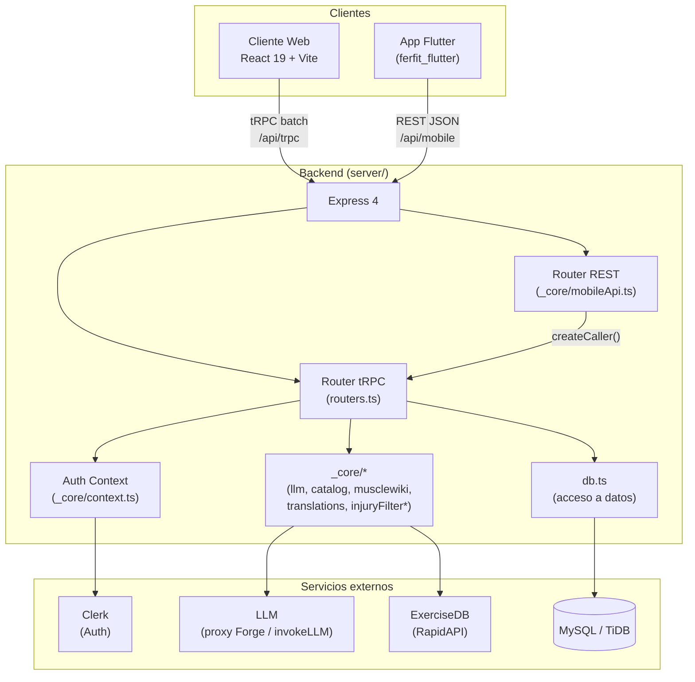
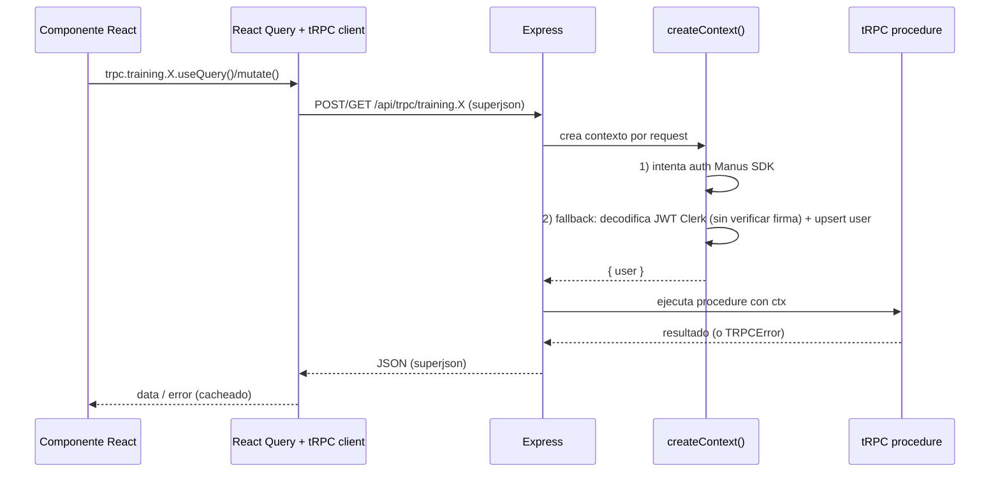
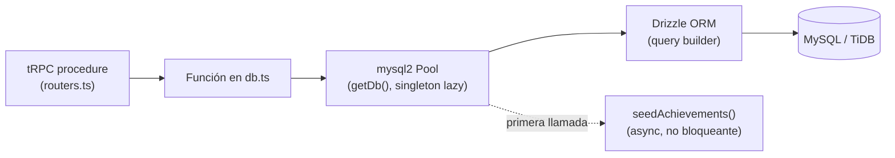
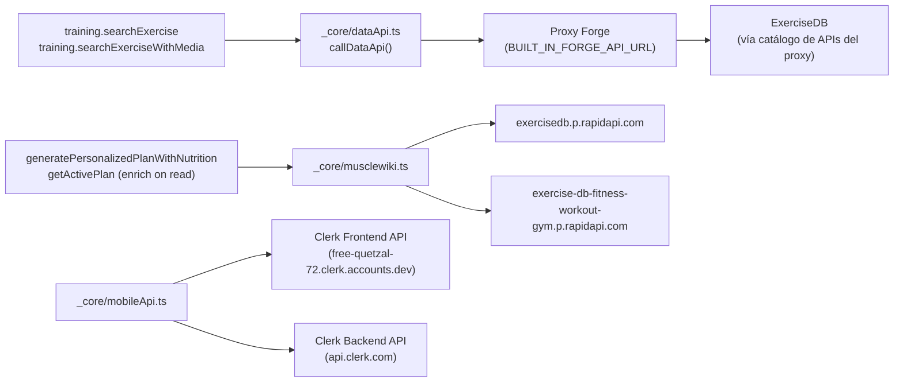
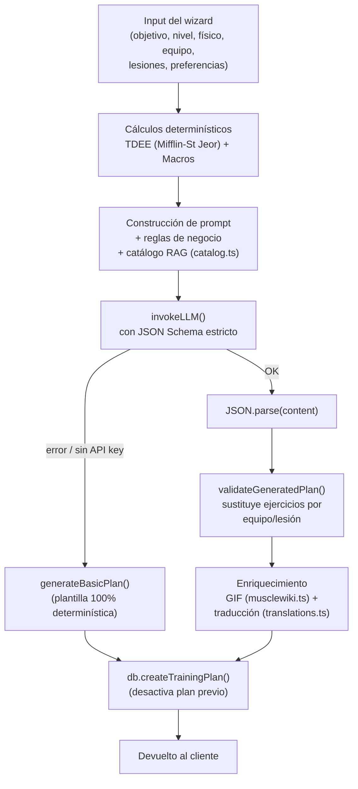
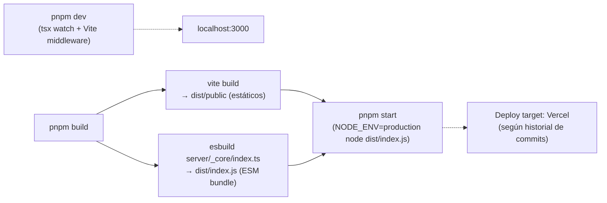

# 05 · Arquitectura

> Última actualización: 2026-07-04

## 1. Vista general de componentes

`injuryFilter.ts` se marca con `*` porque existe en el código pero no está conectado a ningún flujo (ver [07_TECHNICAL_DEBT.md](07_TECHNICAL_DEBT.md)).

## 2. Flujo Front → Backend

## 3. Flujo Backend → Base de datos

Puntos clave:
- El pool se crea de forma perezosa en el primer `getDb()`; si `DATABASE_URL` no está seteado, todas las funciones de `db.ts` devuelven `null`/`[]` en vez de lanzar (fallos silenciosos por diseño).
- No hay capa de migraciones ejecutada automáticamente al boot — se corre manualmente vía `pnpm db:push` (`drizzle-kit generate && drizzle-kit migrate`).
- El contenido del plan generado por IA se guarda como JSON en una columna `text` (`training_plans.generatedContent`), no normalizado — ver detalle en [03_BACKEND.md](03_BACKEND.md#7-base-de-datos-drizzle--mysql).

## 4. Flujo Backend → APIs externas (ExerciseDB / Clerk)

Nota: existen **dos caminos distintos** hacia datos de ejercicios (`dataApi.ts` vía proxy Forge, y `musclewiki.ts` vía RapidAPI directo) que no comparten cache ni lógica — ver Technical Debt.

## 5. Flujo Backend → IA (generación de planes)

## 6. Flujo Backend → Scrapers

No existen scrapers en este proyecto. La obtención de datos de ejercicios (GIFs, instrucciones, músculos) es **100% vía API HTTP de terceros** (ExerciseDB en RapidAPI), no scraping de HTML. Se documenta esta ausencia explícitamente porque la plantilla de este documento la contemplaba.

## 7. Despliegue / Build

